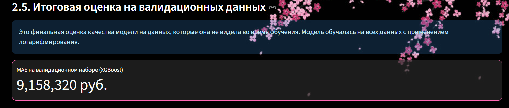
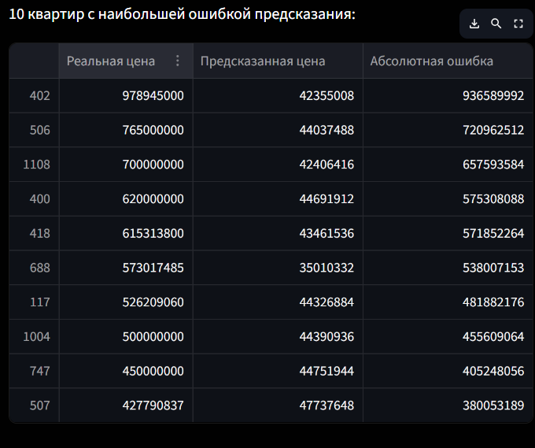

<div align="center">


# 🌸 Предсказание стоимости квартир в Москве 🌸

**Интерактивное веб-приложение на Streamlit для регрессионного анализа и предсказания цен на недвижимость с использованием моделей RandomForest и XGBoost.**

<p>
  
  
  
  
  
</p>

</div>

---

## 📜 Оглавление
- [🌸 О проекте](#-о-проекте)
- [🎯 Задача](#-задача)
- [🛠️ Технологии и инструменты](#-технологии-и-инструменты)
- [🌌 Этапы работы](#-этапы-работы)
  - [Подготовка данных](#1-подготовка-данных)
  - [Инженерия признаков](#2-инженерия-признаков)
  - [Обучение моделей](#3-обучение-моделей)
- [📈 Результаты и оценка](#-результаты-и-оценка)
- [✨ Демонстрация](#-демонстрация)
- [🚀 Как запустить](#-как-запустить)


---

## 🌸 О проекте
Этот проект является практической реализацией **Лабораторной работы №2** по теме "Построение регрессора для предсказания непрерывной величины". Исходная задача из методички (предсказание цен на автомобили) была творчески переосмыслена и адаптирована для более сложного и актуального набора данных о ценах на квартиры в Москве.

Вместо статичного Jupyter, решение представлено в виде **интерактивного веб-приложения на Streamlit**. Приложение позволяет не только провести полный цикл анализа данных, от очистки до обучения моделей, но и делать прогнозы в реальном времени.

<br>
<p align="center">
  
</p>
<br>

---

## 🎯 Задача
Основная цель — разработать и оценить регрессионные модели для предсказания стоимости квартиры на основе её характеристик. Задача соответствует методичке `lab2.ipynb`, но с использованием датасета о московской недвижимости.

Ключевая метрика для оценки качества моделей — **Mean Absolute Error (MAE)**, которая показывает среднее абсолютное отклонение предсказанной цены от реальной.

---

## 🛠️ Технологии и инструменты
| Категория | Инструмент |
| :--- | :--- |
| **Анализ данных** | `Pandas`, `NumPy` |
| **Машинное обучение** | `Scikit-learn` (для предобработки и моделей), `XGBoost` |
| **Веб-приложение** | `Streamlit` |
| **Визуализация** | `Matplotlib` |

---

## 🌌 Этапы работы

### 1. Подготовка данных
🔮 **Очистка и работа с выбросами.** Первым шагом стала загрузка и первичный анализ данных. В приложении реализован интерактивный механизм для фильтрации выбросов по цене с помощью слайдера, что позволяет наглядно оценить его влияние на распределение. Пропущенные значения в числовых признаках заполняются медианой, а в категориальных — модой.

### 2. Инженерия признаков
✨ **Создание новых фичей.** Чтобы улучшить качество предсказаний, были созданы новые синтетические признаки, которые помогают моделям улавливать более сложные зависимости:

```python
# Соотношения и флаги
# Отношение этажа к этажности дома
df['floor_ratio'] = df['Floor'] / df['Number of floors'] 
# Является ли квартира на первом/последнем этаже
df['is_first_floor'] = (df['Floor'] == 1).astype(int)
df['is_last_floor'] = (df['Floor'] == df['Number of floors']).astype(int)
# Отношение жилой и кухонной площадей к общей
df['living_area_ratio'] = df['Living area'] / df['Area']
df['kitchen_area_ratio'] = df['Kitchen area'] / df['Area']```
```
### 3. Обучение моделей
🤖 **Кодирование и тренировка.** Для преобразования категориальных признаков в числовые был применен гибридный подход:
*   **OneHotEncoder** — для признаков с низкой кардинальностью (`Apartment type`, `Renovation`).
*   **OrdinalEncoder** — для признаков с высокой кардинальностью (`Metro station`, `Region`).

В качестве моделей были выбраны мощные ансамблевые методы: **Random Forest** и **XGBoost** с подобранными гиперпараметрами для увеличения точности.

---

## 📈 Результаты и оценка
Приложение в реальном времени рассчитывает **MAE** для обеих моделей на тестовой и валидационной выборках, позволяя сравнить их эффективность.

- **Random Forest** показывает себя как стабильная и точная модель, хорошо работающая "из коробки".
- **XGBoost** также демонстрирует высокую точность, особенно после настройки гиперпараметров.

Пользователь может интерактивно влиять на обучающую выборку (через фильтр цен) и моментально видеть, как это отражается на качестве моделей.

<p align="center">
  
  <i><br>Интерфейс для обучения моделей и оценки их качества по метрике MAE.</i>
</p>

<p align="center">
  
  <i><br>Топ 10 дорогих квартир.</i>
</p>

---

## ✨ Демонстрация
Главная особенность приложения — интерактивный раздел для прогнозирования, где пользователь может ввести параметры квартиры через виджеты в боковой панели и мгновенно получить предсказанную стоимость.

<div align="center">
  
  <p><i><br>Интерфейс приложения для прогнозирования цены на квартиру.</i></p>
</div>

---

## 🚀 Как запустить

**1. Клонируйте репозиторий:**
```bash
git clone https://github.com/vadikbee/BD-LABA2.git
cd [название папки репозитория]